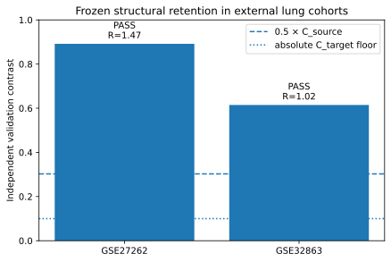
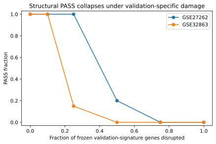
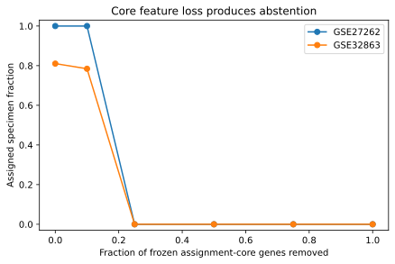
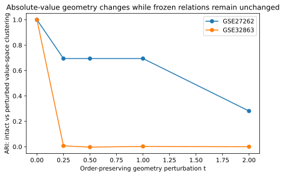

# Transferable Relational Patient Profiles

**From cohort-specific molecular patterns to frozen, executable and scientifically testable patient profiles.**

This repository contains the computational and audit trail for the SONATA BIS research programme:

**From Cohort-Specific Molecular Patterns to Transportable Relational Patient Profiles**

The current programme is organised as:

**LEARN → TRUST → TRANSFER → MAP THE LIMITS**

A Relational Patient Profile (RPP) is a sparse, executable group-level object defined by within-sample relations such as `gene_A > gene_B`. It is learned in a source cohort, frozen, and then executed on an external cohort or an individual new sample without target-side retraining or reclustering.

## Current status

The development-exposed lung preliminary pilot is complete and frozen at:

`preliminary-final-lung-pilot-freeze-2026-09-07`

The lung pilot is a **technical/development anchor**, not untouched confirmation. The future colorectal family remains unopened and is reserved for independent confirmatory work.

### Frozen source evidence

- source cohort: **GSE19804**
- selected frozen structure: **K=2**
- independent source-reference contrast: **C_source = 0.605**
- one-sided 95% lower bound: **0.421**
- frozen validation signature: **10 relations**

### External lung execution

| Target | Structural decision | C_target | R = C_target/C_source | Specimen coverage | Conditional false PASS | Post-freeze accepted ARI |
|---|---:|---:|---:|---:|---:|---:|
| GSE27262 | **PASS** | 0.892 | 1.473 | 1.000 | 0/999 | 0.920 |
| GSE32863 | **PASS** | 0.615 | 1.015 | 0.810 | 0/999 | 0.518 |

For both targets, the exact 95% upper bound on the conditional false-reassurance rate was 0.0037.

Evaluation labels were opened **only after** the complete Stage-2 assignments and structural outputs had been frozen and tagged. The label analysis did not modify any prelabel decision.



## What the pilot supports

The current evidence supports the feasibility of:

- learning a compact source-defined relational assignment artifact;
- separating assignment from an independent molecular validation signature;
- executing the artifact without target-guided retraining;
- explicitly abstaining when assignment support becomes inadequate;
- measuring structural retention independently of conventional label agreement;
- testing false reassurance under controlled validation-block randomisation;
- mapping failure modes under geometry change, validation damage and assignment-core feature loss.

It does **not** establish a universal biological subtype, clinical utility, cohort-agnostic invariance, H2 family-level predictive validity, or independent colorectal confirmation.

## Public data

The repository intentionally does **not** redistribute GEO expression matrices.

All three lung cohorts are publicly available from NCBI GEO:

- GSE19804 — source, GPL570
- GSE27262 — external target, GPL570
- GSE32863 — external target, GPL6884

See [`docs/reproducibility/DATA_ACCESS.md`](docs/reproducibility/DATA_ACCESS.md) for stable accession links, direct download paths and the exact preprocessing rule.

A downloader is provided:

```bash
python scripts/download_public_geo_inputs.py --output-dir data/public_geo
```

## Public replay

After installing the package and downloading the public GEO inputs, the final frozen artifact/signature can be replayed directly from the public Series Matrix files:

```bash
python -m venv .venv
python -m pip install -U pip
python -m pip install -e ".[test]"

python scripts/download_public_geo_inputs.py --output-dir data/public_geo
python scripts/public_replay_lung_pilot.py \
    --data-dir data/public_geo \
    --output-dir public_replay_outputs
```

The public replay:

1. reconstructs the exact Entrez-ID common feature universe from GPL570/GPL6884 annotations;
2. rebuilds participant identities from GEO sample metadata;
3. reconstructs the independent V3 source-reference contrast;
4. executes the frozen RPP artifact and frozen validation signature on both external targets;
5. recomputes the structural endpoint;
6. derives the public tumor/adjacent-normal labels from GEO titles only after execution;
7. recomputes accepted/forced ARI and NMI;
8. compares the replayed values with the committed frozen results.

See [`docs/reproducibility/PILOT_REPRODUCIBILITY.md`](docs/reproducibility/PILOT_REPRODUCIBILITY.md).

## Audit trail and intermediate results

The repository retains unsuccessful and superseded stages instead of rewriting history.

Key milestones include:

- V1 protocol freeze and source-side `NO_STABLE_STRUCTURE`;
- V2 null-calibrated stability gate and `INSUFFICIENT_SOURCE_SIGNATURE`;
- V3 assignment-stratified holdout freeze and `SOURCE_REFERENCE_PASS`;
- Stage-2 implementation freeze before target-value access;
- archived partial Stage-2 output after an implementation failure;
- complete Stage-2 prelabel result freeze;
- Stage-3 descriptive label-analysis implementation freeze;
- final lung pilot freeze.

See:

- [`docs/reproducibility/AUDIT_TRAIL.md`](docs/reproducibility/AUDIT_TRAIL.md)
- [`docs/preliminary/RESULTS_INDEX.md`](docs/preliminary/RESULTS_INDEX.md)

## Mechanistic controls

### Validation-signature damage



### Assignment-core feature loss



### Order-preserving geometry perturbation



The B perturbation changed conventional value-space geometry while producing zero flips in the frozen assignment/signature relations at every tested dose. C progressively destroyed structural PASS as validation genes were damaged. D caused abstention when assignment-core support was removed.

## Repository layout

- `src/relational_patient_profiles/`
  - deterministic RR_DIRECT induction;
  - versioned executable RPP artifact;
  - transportability/support utilities.
- `scripts/`
  - source-side V1/V2/V3 execution;
  - Stage-2 prelabel target execution;
  - Stage-3 post-freeze label analysis;
  - public GEO downloader and public replay;
  - figure regeneration.
- `docs/preliminary/`
  - frozen protocols/configuration;
  - exact source splits and artifacts;
  - V1/V2/V3 intermediate outcomes;
  - Stage-2 prelabel outputs;
  - Stage-3 descriptive outputs;
  - final evidence summary.
- `docs/reproducibility/`
  - public data acquisition;
  - replay instructions;
  - immutable audit chronology.
- `tests/`
  - unit and regression tests.

## Verify repository code

```bash
python -m pytest -q
python scripts/demo.py
```

## Scope boundary

This project does not claim universal robustness, clinical decision support, privacy guarantees, or a universal biological subtype. Supervised phenotype agreement is secondary evaluation; the primary external endpoint in the current pilot is independent structural retention.
