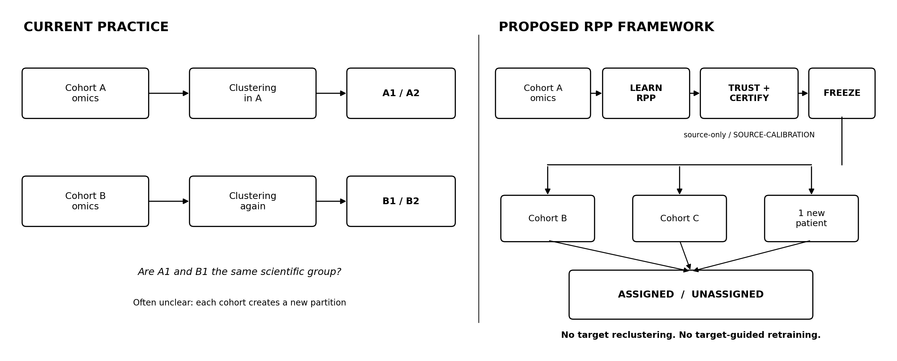

# Transferable Relational Patient Profiles

**From cohort-specific omics patterns to frozen, executable and scientifically testable patient-group definitions.**

This is the clean computational/scientific repository for the SONATA BIS research programme:

**From Cohort-Specific Omics Patterns to Transferable Relational Patient Profiles**.

> **Can patient-group structure discovered in one omics cohort be encoded as a compact relational patient profile that remains executable, interpretable and scientifically testable under cohort and platform shift without target-guided retraining - and can we determine when such transfer should be rejected?**

## Scientific object

A **Relational Patient Profile (RPP)** is a group-level object represented by a sparse executable set of within-sample relations such as `gene_A > gene_B`. The profile is learned during unsupervised discovery, frozen, and then executed on an independent cohort or one new sample without target reclustering.

**RPP scientific object -> sparse executable relational prototype -> RR_DIRECT induction -> frozen execution.**

The framework also makes negative outcomes explicit:
- `NO_STABLE_STRUCTURE` - source data do not justify a reusable group structure;
- `UNASSIGNED` - a target sample cannot be assigned with sufficient coverage/score/margin;
- `NOT_CERTIFIABLE` - source calibration is insufficient for a stated transportability certificate.

## LEARN -> TRUST/CERTIFY -> TRANSFER -> MAP THE LIMITS

```text
Current practice
Cohort A -> clustering -> A1/A2
Cohort B -> clustering again -> B1/B2
                         ? A1 == B1 ?

Proposed
Cohort A -> LEARN RPP -> TRUST + CERTIFY -> FREEZE
                                            |-> Cohort B
                                            |-> Cohort C
                                            |-> one new patient
                                                ASSIGNED / UNASSIGNED
```

No target reclustering. No target-guided retraining.



The intuitive direction is **structural extrapolation** of a frozen scientific group definition beyond its discovery cohort. The formal terminology is cross-cohort transportability, domain generalization, and robustness under distribution shift.

## Relational Transportability Certificate (RTC/RTR)

For an explicitly declared perturbation class, the project asks not only whether transfer succeeds empirically, but how far a frozen assignment can be perturbed before its assignment conditions are no longer guaranteed.

`SOURCE-FIT` learns and freezes the RPP. An independent `SOURCE-CALIBRATION` subset then yields pointwise assignment-preserving radii. Exact one-sided nonparametric tolerance bounds convert these to a profile-level **Relational Transportability Radius (RTR)** at predeclared population coverage/confidence. If calibration is insufficient, the result is `NOT_CERTIFIABLE`.

This certificate is conditional and model-relative. It does not certify arbitrary structural or mixture shift.

## Prospective external validation - do not unseal early

The primary lung module is frozen as:
- source: **GSE19804**;
- untouched target 1: **GSE27262**;
- untouched target 2: **GSE32863**.

One unchanged source artifact must be executed on both targets. The primary gate requires **executable coverage >= 0.70 and forced all-sample ARI >= 0.50 on both targets**. A failed target cannot be replaced after unsealing.

See `docs/prospective/EXTERNAL_VALIDATION_FREEZE_v2.md`.

## Preliminary evidence

The authoritative historical pilot remains in the archived/original repository:
`mczajkowskipb/omics-representation-audit-pilot`.

Pilot v2 remains **STOP (4/5)**. Negative evidence is retained. See `docs/evidence/PILOT_V2_EVIDENCE_SNAPSHOT.md` and `docs/evidence/PROVENANCE.md`.

## Repository layout

- `src/relational_patient_profiles/rr_direct.py` - deterministic direct sparse relational prototype induction;
- `src/relational_patient_profiles/artifact.py` - versioned executable `RelationalPatientProfileArtifact/v1`;
- `src/relational_patient_profiles/transportability.py` - RTC/RTR and distribution-free source calibration;
- `schemas/` - machine-readable artifact/certificate schemas;
- `docs/scientific/` - current grant-facing scientific formulation;
- `docs/prospective/` - frozen future target protocol;
- `docs/evidence/` - compact evidence/provenance boundary;
- `tests/` - unit tests independent of target outcomes.

## Verify

```bash
python -m venv .venv
.venv/bin/python -m pip install -U pip
.venv/bin/python -m pip install -e '.[test]'
.venv/bin/python -m pytest -q
python scripts/demo.py
```

No target outcome is needed for these checks.

## Scope boundary

This project does **not** claim universal robustness, cohort-agnostic invariance, formal federated learning, formal privacy guarantees, or clinical decision support. Supervised phenotype classification is secondary evaluation only.
